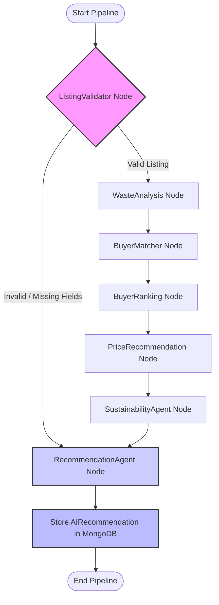

# 🌍 ReuseHub — Smart AI-Powered Circular Economy & Waste Recycling Marketplace

ReuseHub is a comprehensive web platform that bridges the gap between waste **Suppliers** (businesses with recyclable industrial/commercial waste) and **Buyers** (recyclers and manufacturing units looking for secondary raw materials). 

By leveraging a custom **Multi-Agent LangGraph workflow** on the backend, ReuseHub analyzes listings for grading, calculates carbon offset and environmental impact scores, recommends pricing models, and dynamically matches/ranks potential buyers for transaction success.

---

## 🚀 Key Features

### 👤 For Suppliers
- **Create & Manage Listings:** Easily list waste items with detailed specifications (category, quantity, unit, price, description, images).
- **Interactive Dashboard:** View real-time statistics of active listings, real waste successfully reused (in kg), and cumulative CO₂ saved.
- **AI Recommendation Assistant:** Get on-demand, step-by-step grading, pricing suggestions, and sustainability scores.
- **Sustainability Certificates:** Generate, view, and print/download official PDF sustainability certificates (with integrated QR verification) based on recycled waste achievements.

### 💼 For Buyers
- **Demand Registration:** Raise formal demands specifying the type, category, and quantity of raw material needed.
- **Dynamic Marketplace:** Browse available waste listings with category, location, and distance filters.
- **Match Notification:** Directly match with suppliers whose listings align with the buyer's material requirements (within a flexible $\pm100\text{ kg}$ range).

### 🤖 LangGraph Multi-Agent Pipeline
The backend uses a compiled **StateGraph** architecture to run a series of specialized nodes in a deterministic, sequential, and conditional pipeline:
1. **ListingValidator:** Checks listings for mandatory field validation, quantity ranges, price realism, and duplication.
2. **WasteAnalysis:** Assesses waste category to grade recyclability and calculate a quality grade score (30–100).
3. **BuyerMatcher:** Searches the database for open buyer demands matching the waste category within $\pm100\text{ kg}$ quantity.
4. **BuyerRanking:** Computes a compatibility score based on category match, quantity closeness, historical match success, and sustainability priority.
5. **PriceRecommendation:** Suggests optimized price per kg based on previous database listings and demand pressure, incorporating bulk discounts.
6. **SustainabilityAgent:** Calculates landfill volume reduction and carbon emissions avoided (in tons of CO₂) using category-specific emission factors.
7. **RecommendationAgent:** Orchestrates and compiles all outputs, records final recommendations into MongoDB, and generates descriptive reasoning text.

---

## 🛠️ Technology Stack

### Frontend (Client-side)
- **Framework:** React 19 + Vite
- **Styling:** Tailwind CSS v4 (Modern CSS-first approach)
- **Animations:** Framer Motion (for smooth micro-interactions, fade-ins, and page transitions)
- **Icons:** Lucide React
- **Data Visualization:** Recharts (interactive circular economy charts, monthly and categorical waste stats)
- **PDF Generation:** jsPDF + html-to-image + react-to-print (for high-fidelity sustainability certificates)

### Backend (Server-side)
- **Runtime:** Node.js + Express.js
- **Database:** MongoDB + Mongoose (Schema validation & relationships)
- **Orchestration:** `@langchain/langgraph` + `@langchain/core` (Agent coordination and workflow state management)
- **Authentication:** JSON Web Tokens (JWT) + bcryptjs (Secure hashing)
- **Emails:** Nodemailer (for contact inquiries, matching alerts, and credentials notifications)

---

## 📐 Architecture & Agent Flow

The backend orchestrates the AI insights through the following state graph workflow:



---

## 📁 Repository Structure

```text
Reusehub_3/
├── backend/
│   ├── config/             # DB connection settings
│   ├── controllers/        # Express controllers (Auth, AI, Admin, Demands, Listings, Matches)
│   ├── langgraph/          # LangGraph agents workflow
│   │   ├── nodes/          # Specialized worker nodes (BuyerMatcher, PriceRecommendation, etc.)
│   │   ├── graph.js        # Compiles StateGraph and sets conditional edges
│   │   ├── state.js        # Global StateAnnotation object properties
│   │   └── utils.js        # Helper converters (e.g. quantity conversions to kg)
│   ├── middleware/         # JWT Auth protections and validation middlewares
│   ├── models/             # Mongoose schemas (User, WasteListing, Demand, AIRecommendation, Match, Certificate)
│   ├── routes/             # REST Endpoints mapping
│   ├── utils/              # Email utilities and password scripts
│   ├── server.js           # Server entrance script
│   └── package.json        # Backend dependencies & npm scripts
│
├── frontend/
│   ├── public/             # Static public assets
│   ├── src/
│   │   ├── assets/         # App local assets, logos, and images
│   │   ├── components/     # UI elements (Navbar, Footer, Sidebar, Cards, Certificate templates)
│   │   ├── pages/          # View templates (Dashboard, Marketplace, Matches, Analytics, Certificate, Login)
│   │   ├── services/       # API call handlers via Axios (Auth, Waste, Demands, AI, Certificates)
│   │   ├── utils/          # Helpers (including PDF converters)
│   │   ├── App.jsx         # App router and view controller
│   │   └── main.jsx        # App root element binder
│   ├── vite.config.js      # Vite compilation configuration
│   ├── package.json        # Frontend dependencies & npm scripts
│   └── vercel.json         # Vercel deployment configuration
│
└── vercel.json             # Root-level Vercel routing configuration
```

---

## ⚙️ Installation & Setup

### 1. Prerequisites
- [Node.js](https://nodejs.org/) installed (v18+ recommended)
- A running [MongoDB](https://www.mongodb.com/) instance (local or MongoDB Atlas connection string)

### 2. Clone the Repository & Install Dependencies
First, navigate into the project directory:

```bash
# Go to backend and install
cd backend
npm install

# Go to frontend and install
cd ../frontend
npm install
```

### 3. Environment Configurations

#### Backend Environment Variables
Create a file named `.env` in the `backend/` directory:

```env
PORT=5000
MONGO_URI=your_mongodb_connection_string
JWT_SECRET=your_jwt_secret_token
EMAIL_USER=your_smtp_email_address
EMAIL_PASS=your_smtp_email_app_password
```

#### Frontend Environment Variables
Create a file named `.env` in the `frontend/` directory:

```env
VITE_API_URL=http://localhost:5000
```

### 4. Running the Application Locally

#### Start Backend Server
In the `backend/` directory, run:
```bash
# Development mode with Nodemon
npm run dev

# Or production start
npm start
```
*The backend server should start running at `http://localhost:5000`.*

#### Start Frontend Client
In the `frontend/` directory, run:
```bash
# Start Vite development server
npm run dev
```
*Open your browser and navigate to `http://localhost:5173`.*

---

## 🔌 API Endpoints Summary

| Method | Endpoint | Description | Auth Required |
| :--- | :--- | :--- | :--- |
| **POST** | `/api/auth/register` | Register a new user (Supplier / Buyer) | No |
| **POST** | `/api/auth/login` | Login user and obtain JWT token | No |
| **GET** | `/api/listings` | Fetch all waste listings | Yes |
| **POST** | `/api/listings` | Create a new waste listing | Yes |
| **GET** | `/api/demands` | Fetch demands based on user | Yes |
| **POST** | `/api/demands` | Register a new buyer demand | Yes |
| **POST** | `/api/ai/analyze/:listingId` | Run LangGraph workflow on a listing | Yes |
| **GET** | `/api/ai/recommendation/:listingId` | Retrieve saved AI recommendations | Yes |
| **POST** | `/api/ai/share-contact` | Share contact details (creates match) | Yes |
| **GET** | `/api/analytics` | Fetch personalized stats (Supplier/Buyer/Admin) | Yes |
| **GET** | `/api/analytics/public` | Public stats for Landing Page | No |
| **GET** | `/api/certificates` | Fetch generated sustainability certificates | Yes |
| **POST** | `/api/certificates/generate` | Generate certificate based on recycling output | Yes |
| **POST** | `/api/contact` | Submit a general inquiry contact form | No |

---

## 🔒 Verification & Account Testing
When registering, you can specify your **Account Type**:
- **Supplier:** Grants access to the Supplier Dashboard, listing creation tools, matches, and Certificate generator.
- **Buyer:** Grants access to the Buyer Dashboard, demand registry, and the general Waste Marketplace.
- **Admin:** To gain admin privileges, configure your database user's role to `admin` or use the database management credentials.

---

## 📄 License
This project is licensed under the ISC License. Feel free to clone, edit, and contribute to building a greener, cleaner circular economy!
