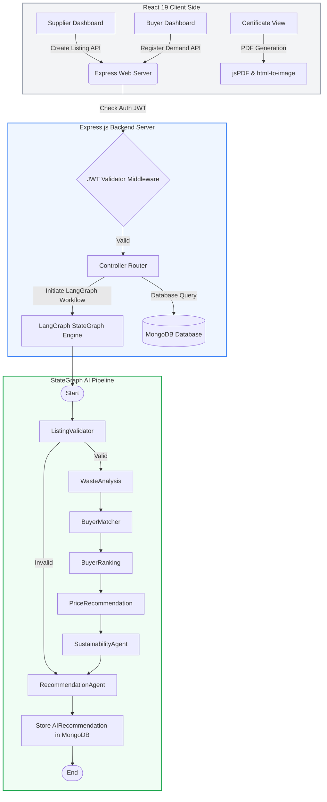

# On-Campus Internship Report (Summer 2026)

## Project Title: ReuseHub — Smart AI-Powered Circular Economy & Waste Recycling Marketplace

**Under the Supervision of:**  
Prof. [Supervisor Name / Professor Name]  
Department of Computer Science & Engineering  
Dhirubhai Ambani Institute of Information and Communication Technology (DA-IICT) / Dhirubhai Ambani University (DAU)  

**Prepared & Submitted By:**  
*   **Mahi Kansara** (Email: mahi.kansara1904@gmail.com)  
*   **Rishika Shah** (Email: rishikashah2674@gmail.com)  

---

## Abstract

This report outlines the implementation details and outcomes of our on-campus internship, during which we developed **ReuseHub**—a smart, AI-powered circular economy platform. ReuseHub bridges the gap between industrial/commercial waste **Suppliers** and **Buyers** (recyclers/manufacturers looking for secondary raw materials). The platform employs a custom, server-side multi-agent AI pipeline utilizing the LangGraph framework (`@langchain/langgraph`) to automatically validate listings, assess waste quality, dynamically match and rank potential buyers, suggest optimized pricing models, and calculate carbon offsets and environmental impacts. The frontend, built using React 19, Vite, and Tailwind CSS v4, provides user-interactive analytical dashboards, automated match notifications, and custom PDF sustainability certificates (with QR-code-based verification). This document details the platform architecture, core functionalities, database schemas, agent workflows, implementation timeline, challenges faced, and conclusions.

---

## I. Abbreviations

1.  **MERN** — MongoDB, Express.js, React, Node.js
2.  **DAG** — Directed Acyclic Graph
3.  **JWT** — JSON Web Token
4.  **REST** — Representational State Transfer
5.  **CO₂** — Carbon Dioxide (Carbon Emissions)
6.  **AI** — Artificial Intelligence
7.  **LLM** — Large Language Model
8.  **QR** — Quick Response (Code)
9.  **API** — Application Programming Interface
10. **JSON** — JavaScript Object Notation
11. **BSON** — Binary JSON (MongoDB data storage format)
12. **DOM** — Document Object Model

---

## II. Project Overview & Motivation

Rapid industrialization and urbanization have led to unprecedented levels of commercial and industrial waste. However, much of this waste is recyclable and could serve as valuable secondary raw materials for other manufacturing units. The traditional waste management ecosystem suffers from several critical bottlenecks:
*   **Information Asymmetry:** Waste suppliers (businesses) struggle to locate qualified recyclers who require specific materials in particular quantities.
*   **Pricing Ambiguity:** Determining fair pricing for secondary raw materials is difficult due to changing demand pressure and lack of historical transaction baselines.
*   **Traceability and Compliance:** Businesses lack streamlined mechanisms to verify the environmental impact of their recycling actions or generate verifiable sustainability reports.

To address these limitations, **ReuseHub** was designed as an intelligent, automated circular marketplace. By combining modern web technologies (React 19 + Express.js) with state-of-the-art AI orchestration tools (LangGraph), ReuseHub automates the listing-validation-matching lifecycle, estimates exact carbon offset metrics, and generates official, verified certificates.

---

## III. Platform Design & Architecture

The ReuseHub platform adopts a decoupled client-server architecture, enabling high responsiveness on the frontend and scalable transaction/AI logic on the backend.

### A. Architectural Workflow



### B. Technology Stack

*   **Frontend Technologies:**
    *   **React 19 & Vite:** Next-generation rendering framework and bundler for fast loading and hot module replacement.
    *   **Tailwind CSS v4:** Utility-first CSS framework using a modern CSS-first configuration to build responsive user interfaces.
    *   **Framer Motion:** Declarative animations library used for smooth page transitions, list items staggered fade-ins, and micro-interactions.
    *   **Recharts:** Interactive charting library used to render circular economy statistics, monthly trends, and carbon reduction metrics.
    *   **jsPDF & html-to-image:** client-side packages to parse live DOM elements and download high-resolution PDF sustainability certificates.
*   **Backend Technologies:**
    *   **Node.js & Express.js:** Fast, asynchronous, event-driven JavaScript runtime and web framework.
    *   **Mongoose & MongoDB:** Document-based NoSQL database utilized for flexible, hierarchical schema management.
    *   **LangGraph (`@langchain/langgraph` & `@langchain/core`):** Orchestrates multiple analytical AI agents through a shared graph state, supporting validation, ranking, and scoring.
    *   **Nodemailer:** Handles automated system email notifications when matches are made, accounts are verified, or inquiries are submitted.
    *   **JWT & bcryptjs:** Secures authentication protocols, hashes database passwords, and manages session state.

---

## IV. Preliminaries & Core Concepts

Before detailing the code implementation, we outline key preliminaries and formulas integrated into the platform logic:

### A. Circular Economy Matching
A circular economy marketplace depends on precision matching. Unlike typical consumer e-commerce, secondary raw materials are highly constrained by category compatibility (e.g., a paper mill cannot process plastic scrap) and physical quantity constraints. In ReuseHub, the matching algorithm enforces:
1.  **Strict Category Matching:** Material categories must match exactly.
2.  **Flexible Quantity Range:** Demand quantity $Q_d$ and supply quantity $Q_s$ must satisfy:
    $$|Q_s - Q_d| \le 100\text{ kg}$$
    This matches suppliers and buyers who can agree on transaction sizes without causing logistical inefficiencies.

### B. Carbon Offset Calculation
The environmental impact calculations use standardized CO₂ emission savings factors ($F_{cat}$) for recycled materials. The factors reflect the amount of carbon emissions avoided by recycling $1\text{ kg}$ of waste instead of disposing of it in a landfill or manufacturing virgin materials.

| Material Category | CO₂ Saved Factor ($F_{cat}$) per kg |
| :--- | :--- |
| **Metal Waste** | $2.20\text{ kg}$ |
| **Plastic Waste** | $1.50\text{ kg}$ |
| **Textile Waste** | $1.20\text{ kg}$ |
| **Rubber Waste** | $1.10\text{ kg}$ |
| **Paper Waste** | $0.90\text{ kg}$ |
| **Wood Waste** | $0.60\text{ kg}$ |
| **Glass Waste** | $0.50\text{ kg}$ |
| **E-Waste** | $3.00\text{ kg}$ |
| **Default Baseline** | $0.44\text{ kg}$ |

The cumulative carbon emissions avoided (in tons of CO₂) are calculated using the formula:
$$\text{Carbon Saved (Tons)} = \frac{Q_s \times F_{cat}}{1000}$$

---

## V. Internship Training & Work Schedule

Our internship spanned a 10-week period, structured as follows:

| Timeline | Phase Description | Key Activities & Deliverables |
| :--- | :--- | :--- |
| **Weeks 1–2** | **Technical Onboarding & Stack Setup** | Studying React 19, Tailwind CSS v4, Express framework, and Mongoose modeling. Setting up the version control repository and basic workspace. |
| **Weeks 3–4** | **Schema Design & Database Layer** | Designing database schemas for Users, WasteListings, Demands, and Matches. Writing CRUD APIs and JWT authorization middleware. |
| **Weeks 5–6** | **LangGraph AI Pipeline Integration** | Developing the StateGraph structure. Implementing specialized nodes for validation, ranking, and environmental analysis. |
| **Weeks 7–8** | **Frontend Dashboards & Certificates** | Building dashboards using Recharts, creating forms for listings and demands, and implementing the jsPDF certificate module. |
| **Weeks 9–10** | **Testing, Refactoring, & Documentation** | Debugging edge cases in unit conversions, testing email notifications, writing the README, and finalizing the internship report. |

---

## VI. Technical Contributions & Detailed Work

### A. The LangGraph Multi-Agent Pipeline

The core of ReuseHub is its backend AI analysis pipeline, configured as a Compiled StateGraph. Each node acts as a specialized assistant that reads from and writes to a shared state object.

#### 1. Graph State Model (`state.js`)
The shared state coordinates data between agent nodes:
```javascript
const StateAnnotation = Annotation.Root({
  listingId: Annotation(),
  listing: Annotation(),
  validation: Annotation(),
  analysis: Annotation(),
  matches: Annotation(),
  rankings: Annotation(),
  price: Annotation(),
  sustainability: Annotation(),
  recommendation: Annotation(),
});
```

#### 2. Specialized Pipeline Nodes (`backend/langgraph/nodes/`)

*   **`ListingValidator.js`**
    Checks if all required fields are present and validates quantity and pricing logic. It also queries MongoDB to verify that the supplier has not posted a duplicate listing within the last 5 minutes, preventing spam.
    ```javascript
    const fiveMinutesAgo = new Date(Date.now() - 5 * 60 * 1000);
    const duplicate = await WasteListing.findOne({
      owner: listing.owner,
      name: listing.name,
      category: listing.category,
      _id: { $ne: listing._id },
      createdAt: { $gte: fiveMinutesAgo },
    });
    ```
*   **`WasteAnalysis.js`**
    Calculates a base material quality score. Listings that provide descriptive details (>50 characters) receive a $+10$ score, and listings with images receive a $+5$ bonus. High-recyclability waste (e.g., metal, plastic, paper) receives an additional score bump, outputting a final quality rating between $30$ and $100$.
*   **`BuyerMatcher.js`**
    Queries open demands in MongoDB. It applies category matching and filters results to buyers within a $\pm100\text{ kg}$ range of the listed waste quantity. Demands already matched and accepted by other suppliers are excluded.
*   **`BuyerRanking.js`**
    Computes a composite compatibility score out of $100$ for eligible buyers based on:
    *   **Category Match (50% max):** Automatically satisfied if the category matches.
    *   **Quantity Closeness (25% max):** Linear penalty based on quantity difference:
        $$\text{Qty Closeness Score} = \left(1 - \frac{|Q_s - Q_d|}{100}\right) \times 25$$
    *   **Historical Activity (15% max):** Proven history of accepted matches yields the full $15$ points.
    *   **Sustainability Priority (10% max):** General recycling priority points.
    The final score is capped between $50\%$ and $99\%$. The top 3 buyers are ranked and passed to the next node.
*   **`PriceRecommendation.js`**
    Analyzes historical listing prices for the same category. If previous transactions exist, it averages them; otherwise, it falls back to predefined baseline prices (e.g., metal: ₹85/kg, e-waste: ₹120/kg). It applies a bulk discount (10% discount for listings $>5000\text{ kg}$, 5% discount for listings $>1000\text{ kg}$) to suggest an optimized price and estimate total revenue.
*   **`SustainabilityAgent.js`**
    Computes carbon savings based on category factors. It also estimates landfill reduction in kilograms and calculates a project-wide Environmental Impact Score based on the waste volume and its recyclability grade.
*   **`RecommendationAgent.js`**
    Synthesizes the output data, writes the complete `AIRecommendation` document into MongoDB, and generates structured reasoning text explaining why the top buyer is the best match.

---

### B. Frontend Page Implementations (`frontend/src/pages/`)

*   **Supplier Dashboard & Listing Creation (`Dashboard.jsx`, `CreateListing.jsx`):**  
    Provides suppliers with visual metrics showing cumulative CO₂ saved, waste listed, active listings, and successfully reused materials. The layout is built using Tailwind grid elements, and the data is visualized using Recharts area and bar charts.
*   **Waste Marketplace & Analytics (`Marketplace.jsx`, `Analytics.jsx`):**  
    Allows buyers to browse listed waste items, apply filters (by category, location, and listing date), and view listings.
*   **Sustainability Certificate (`Certificate.jsx`):**  
    Suppliers who successfully complete recycling transactions can generate official certificates. This page reads data from `certificateRoutes` and renders a certificate layout (complete with a certificate ID, date, verified seal, and verification QR code). It then uses `html-to-image` and `jsPDF` to download the certificate as a PDF file.

---

### C. Database Model & Schema Design (`backend/models/`)

The database uses MongoDB schemas managed through Mongoose to store application data:

1.  **User Schema:** Stores owner names, business emails, hashed passwords, roles (`supplier`, `buyer`, or `admin`), locations, and business descriptions.
2.  **WasteListing Schema:** Represents waste offered by suppliers. Tracks title, category, quantity, unit, price, description, image, and status.
3.  **Demand Schema:** Tracks materials needed by buyers, including quantity, unit, category, location, and status.
4.  **AIRecommendation Schema:** Stores outputs from the LangGraph pipeline, including quality scores, suggested pricing, environmental impact, carbon offsets, and candidate buyer lists.
5.  **Match Schema:** Tracks matches between listing and demand, including status (`pending`, `shared_contact`, `accepted_by_supplier`, or `rejected`).

---

## VII. Implementation Challenges & Technical Learnings

During the development lifecycle, we encountered several technical challenges that required structural changes:

### A. Uniform Unit Normalization
*   **Challenge:** Users listed waste in various units (e.g., tons, kilograms, grams, metric tons). The matching agent failed when comparing a supply of $2\text{ tons}$ with a demand of $2000\text{ kg}$ because the absolute difference was numerically high.
*   **Solution:** We created a unit converter helper (`backend/langgraph/utils.js`) that normalizes all quantities to kilograms before any calculations:
    ```javascript
    const getQtyInKg = (doc) => {
      if (!doc || !doc.quantity) return 0;
      const qty = parseFloat(doc.quantity);
      const unit = (doc.unit || "kg").toLowerCase().trim();
      if (unit === "tons" || unit === "ton" || unit === "t") return qty * 1000;
      if (unit === "grams" || unit === "g") return qty / 1000;
      return qty; // default kg
    };
    ```

### B. Graph State Synchronization in Express
*   **Challenge:** Setting up the Express controller to trigger the LangGraph StateGraph asynchronously required careful state handling. Express must wait for the compiled graph's `invoke()` method to finish before retrieving database recommendations.
*   **Solution:** We structured the `/api/ai/analyze/:listingId` route handler as an asynchronous wrapper. It initializes the shared state with the target `listingId`, awaits the compiled graph's execution, and then queries MongoDB for the saved results to return to the client.

### C. PDF Render Quality across Dynamic Viewports
*   **Challenge:** Generating PDF certificates client-side using standard Canvas print triggers sometimes caused low resolutions or broken CSS layouts on mobile screen viewports.
*   **Solution:** We isolated the certificate layout within a hidden, fixed-width print element (`CertificatePreview.jsx`). The `downloadCertificate` utility captures this element off-screen using a high-density canvas multiplier ($2\times$ pixel ratio) and parses it into a high-fidelity vector PDF.

---

## VIII. Conclusion & Future Scope

### A. Conclusion
The ReuseHub project successfully demonstrates how a multi-agent AI system can automate and optimize waste recycling marketplaces. By integrating a compiled StateGraph, the platform replaces manual search with automated matching, pricing recommendations, and carbon tracking. Over the course of this internship, we gained hands-on experience in MERN stack development, state management, document database schema design, and agentic AI architectures using LangGraph.

### B. Future Scope
*   **Geospatial Distance Matching:** Integrating the Google Maps API or OpenStreetMap to calculate transport distances between suppliers and buyers, factoring travel logistics into the buyer compatibility score.
*   **Blockchain Sustainability Verification:** Writing certificate metadata to a public or private ledger to ensure tamper-proof environmental reporting.
*   **Real-Time WebSocket Notifications:** Implementing socket integrations so suppliers and buyers receive instant desktop push notifications the moment a match is generated.

---

## IX. References

1.  *LangGraph Documentation for JS/TS:* [https://js.langchain.com/docs/langgraph/](https://js.langchain.com/docs/langgraph/)
2.  *MongoDB Atlas & Mongoose Schema Modeling:* [https://mongoosejs.com/docs/](https://mongoosejs.com/docs/)
3.  *Tailwind CSS v4 Configuration & Layout:* [https://tailwindcss.com/docs](https://tailwindcss.com/docs)
4.  *Recharts Interactive Charts Library:* [https://recharts.org/](https://recharts.org/)
5.  *jsPDF and html-to-image Canvas Compilation:* [https://rawgit.com/MrRio/jsPDF/master/docs/index.html](https://rawgit.com/MrRio/jsPDF/master/docs/index.html)
